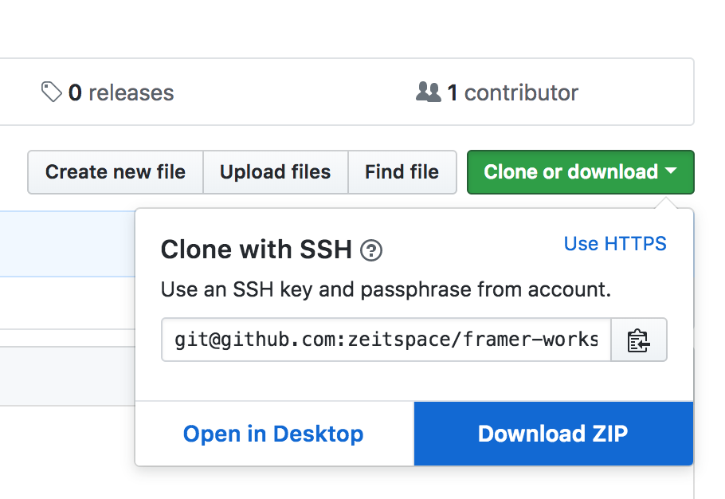

# Framer Workshop
Welcome to the **Intro to Prototyping with Framer** Zeitspace Session!
Let's make sure you're all set up.

## Setup

* Make sure you have the **Framer app** installed. You can download a 2-week free trial (https://framer.com/). Mac only.
* Download the project files in this Github repository, by clicking the `Clone or Download` and then `Download ZIP`. This file contains all the checkpoints for this workshop.



* Extract the ZIP file.
* Open Framer and ensure your trial is activated

## Step 1 - Scrolling Screens
In Framer, click **Open Project...** and navigate to `FramerWorkshop/Step1` folder and select `zeitbook1_begin.framer`.
You will see two artboards: `Home` and `PostsContainer`, as well as a black status bar.

* Create a Header at the top of the `Home` screen. (Use the "Frame" tool in the top left.)
  * Be careful not to let the new `Header` overlap with the `Content` layer.
* Move the dark status bar (below the Home screen) to the Header.
* Drag the Zeitspace logo, found in the `Step1` folder, called `logo.svg` into the Framer window.
* Add the text `ZEITBOOK` at the top.
* Add a plus button in the top right corner.

It should look like this when you're done:


Ensure the Header is pinned to the top, left, and right. This way it will be responsive if we stretch the screen.


If you've used Sketch before, this should be very familiar to you. So far there's not much here we couldn't do in Sketch.
Now, let's create a scrolling new feed using the `Posts` sitting inside the `PostsContainer`.

First, we will need to **target** some elements in our prototype, so that we can use them in the **Code** section.

* Target the `Content` layer inside the `Home` layer. Hover over the element in the sidebar, and click the blue bullseye button. If you now hover over the blue dot, you should see `**Content** in Code`.


* Similary, Target the `Posts` layer inside `PostsContainer`.
* Switch to the **Code** tab at the top of the window.
* Add the following code into the code area:
  ```
  # Create a Scroll Component
  Scroll = new ScrollComponent
    parent: Content
    size: Content.size
    scrollHorizontal: false

  # Put the Posts inside the scroll component content
  Posts.parent = Scroll.content
  ```
* Save the prototype and try it out in the device preview window (in the Code tab)

You should be able to scroll through the list of posts with a fixed header and footer! Voila!

> **Code Explanation**
> * In the code above, we are creating a ScrollComponent - a prebuilt component in Framer. (You can read more about the ScrollComponent here: https://framer.com/docs/#scroll.scrollcomponent)
> * We are placing it inside the `Content` layer by setting `parent: Content`.
> * We are setting the size to be exactly the size of the `Content` layer, by setting `size: Content.size`
> * By default, a ScrollComponent can scroll both vertically and horizontally, however, we only want to allow vertical scrolling. So we set `scrollHorizontal: false`.
> * We are then placing the `Posts` inside the `Scroll.content` layer.

If you are having trouble getting to this point, feel free to open the `zeitbook1_done.framer` checkpoint and you should be all caught up!


## Step 2 - Page to Page links

Go to the folder `Step2` and open the `zeitbook2_start.framer` project.

You should see a variety of Zeitbook screens. We are going to link these screens together!

**Splash Screen**
* Make sure the `Splash`, `StatusBar` (inside `Shell`), and the `Home` layers are targeted. (They should be targeted already.)
* Go to the **Code** tab
* Add the following code to the **top of the file**
```
# Create a Flow Component
Flow = new FlowComponent
    backgroundColor: "#ffffff"
Flow.header = StatusBar
Flow.showNext(Splash)
```
* This will show the `StatusBar` on top of all screens.
* Add the following code **after the Scroll component code**
```
# Show the Home screen after a 1 second delay
Utils.delay 1, ->
    Flow.showNext(Home)
```

The prototype should now wait for 1 second and then transition to the `Home` page.

**Create a new Post**
* Make sure the `CreatePostButton`, `CreatePost`, and `CreatePostBack` (inside `CreatePost > Header`)are all targeted.
* Add the following code to the **end of the file**
```
# Go to the Create Post screen
CreatePostButton.onTap ->
    Flow.showNext(CreatePost)

# Return back to the Home screen
CreatePostBack.onTap ->
    Flow.showPrevious()
```

You should be able to go the Create a new Post page now!

**Home and Chat Tabs**
* Make sure the `Home`, `Chat`, `TabChat` (inside `Home`), and `TabHome` (inside `Chat`) are all targeted. (They should be targeted already.)
* Go to the **Code** tab
* Add the following code to the **end of the file**
```
# Show the Home page when the Home Tab is tapped
TabHome.onTap ->
    Flow.showNext(Home, animate: false)

# Show the Chat page the Chat Tab is tapped
TabChat.onTap ->
    Flow.showNext(Chat, animate: false)
```

You can now switch between the Home and Chat tabs!

**View a Post**
* Make sure the `PostFullscreen`, `Post1` (inside `PostsContainer > Posts`), and `ClosePostFullscreen` (inside `CreatePost > Header`) are all targeted.  (They should be targeted already.)
* Add the following code to the **end of the file**
```
# Show the Post Fullscreen screen when Post1 is tapped
Post1.onTap ->
    Flow.showOverlayCenter(PostFullscreen)

# Return back to the Home screen
ClosePostFullscreen.onTap ->
    Flow.showPrevious()
```

Great! Now we've linked all the screens together. You should be able to navigate everywhere around the prototype now.

If something went wrong, you can open the `zeitbook2_done.framer` project to catch up!
